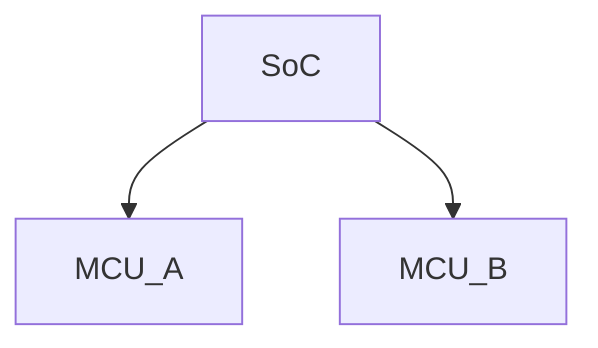

# Markdown syntax

```markdown
# Title 
## Title
### Title
#### Title
##### Title
###### Title
```

---
**bold**
*italic*
~~strike~~
> blockquote
---
```cpp
struct Packet {
    uint32_t seq;
    uint32_t ack;
};
```
---

Euler: $e^{i\pi} + 1 = 0$

---



---

| Feature | Status |
|----------|--------|
| RSS      | OK     |
| Math     | OK     |
| Mermaid  | OK     |

---


# Hugo commands

### Local host develop

```zsh
hugo server -D
```

### Create Post
單篇文章
```zsh
hugo new posts/hello.md
```
#### Page Bundle
```zsh
hugo new posts/hello/index.md
```
圖片放
`content/posts/hello/img/{img_name}.{img_extension}`

### Production build

```zsh
hugo --minify
```