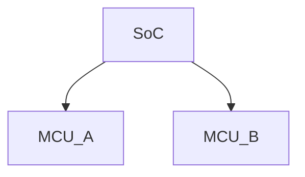

# Title 
## Title
### Title
#### Title
##### Title
###### Title
---
**bold**
*italic*
~~strike~~
> blockquote
---
```cpp
struct Packet {
    uint32_t seq;
    uint32_t ack;
};
```
---

Euler: $e^{i\pi} + 1 = 0$

---



---

| Feature | Status |
|----------|--------|
| RSS      | OK     |
| Math     | OK     |
| Mermaid  | OK     |

---

